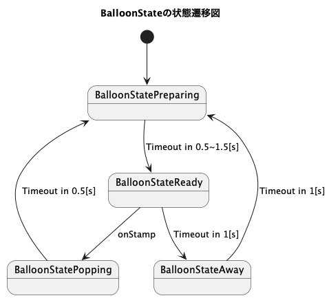

# 風船割りゲーム
SNACKS Vol.5 で展示する作品。

今回は遊べる3Dミニゲームを作ることを目標にする。

demo https://novogrammer.github.io/balloon-popping-game/


## インストール
```
npm install
```


## 開発
```
npm run dev
```

## ビルドとプレビュー

```
npm run build
npm run preview
```

## Firestoreのrules

```
rules_version = '2';

service cloud.firestore {
  match /databases/{database}/documents {
    match /{document=**} {
      allow read, write: if false;
    }
    match /playerScores/{playerScoreId}{
      allow read: if true;
    	allow create: if request.resource.data.name.size()==3 && 0 <= request.resource.data.score;
    }
  }
}
```


## UML
Plant UMLでつくりました。



